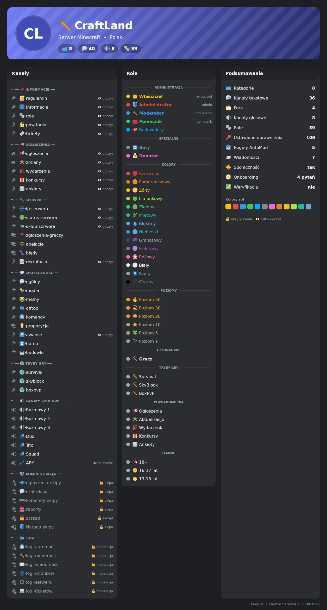
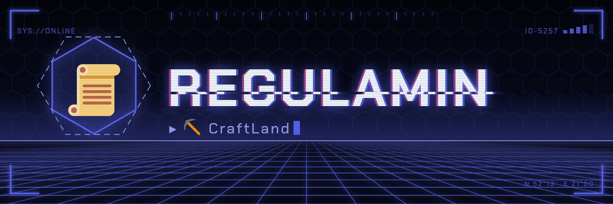
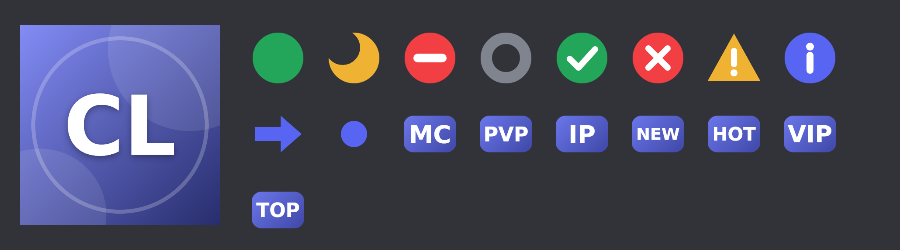
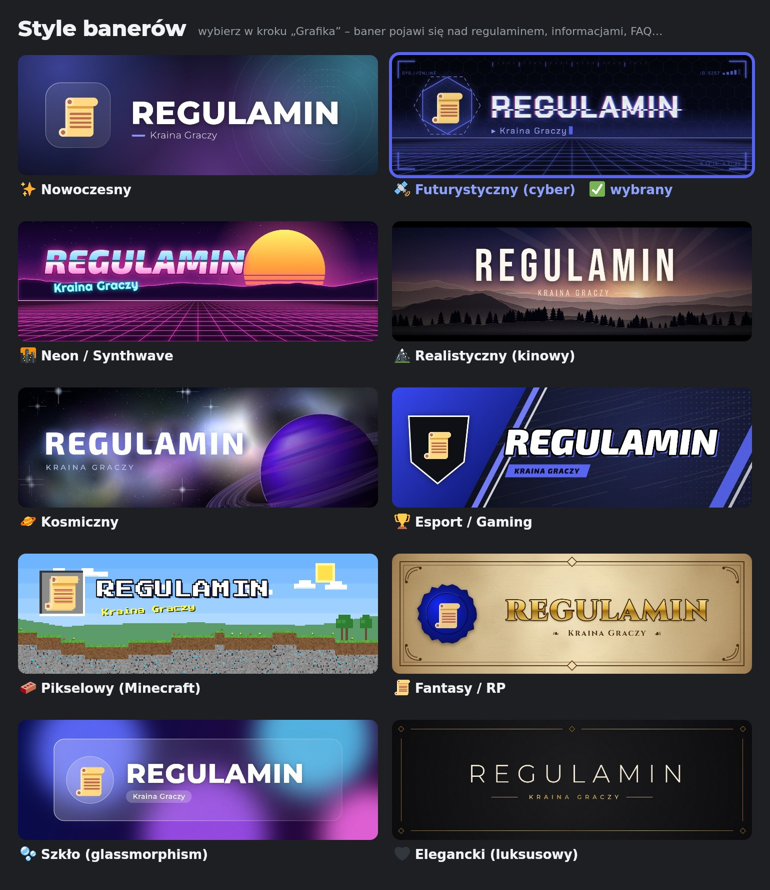

# 🛠️ Kreator Serwera – bot Discord

Bot, który **jedną komendą `/stworz`** buduje cały serwer Discord dokładnie tak, jak go opiszesz:
**role z uprawnieniami, kategorie, kanały z ustawionym dostępem (kto widzi, kto pisze), regulamin, informacje, weryfikację, AutoMod i ustawienia bezpieczeństwa**.

Po wpisaniu `/stworz` otwiera się interaktywny panel (widoczny tylko dla Ciebie), który zadaje **19 szczegółowych pytań** (albo tylko 4 w trybie ⚡ szybkim):
wybierasz opcje z menu, wpisujesz własne nazwy i listy, oglądasz podgląd, a na końcu klikasz **Zbuduj serwer** –
bot tworzy wszystko sam i pokazuje postęp na żywo.

Druga komenda, **`/usun`**, czyści serwer (kanały, role, AutoMod i więcej) – z kopią zapasową, którą można przywrócić jednym poleceniem.

Bot jest **wyłącznie od tworzenia serwerów** – po budowie nie jest potrzebny (nie obsługuje weryfikacji, logów ani żadnych przycisków; wszystkie wiadomości to sam tekst).
Jest przygotowany do **sprzedaży gotowych serwerów**: `/stworz` działa dopiero po wpisaniu **kodu dostępu**, który sprzedawca generuje w konsoli bota (np. na Wispbyte).
Kody mogą mieć **pakiet** (Podstawowy / Standard / Premium), **gotowy szablon** („Minecraft Premium” – klient buduje go jednym kliknięciem) i **termin ważności**,
a o każdym użyciu kodu i każdej budowie bot może powiadomić Cię na Twoim Discordzie.

| Podgląd serwera (obrazek) | Baner nad regulaminem | Ikona z inicjałów i paczka emoji |
|---|---|---|
|  |  |  |

**10 stylów banerów** do wyboru (każdy w kolorze serwera, z własną czcionką):



---

## ✨ Możliwości

| | |
|---|---|
| 🧭 **21 gotowych typów serwerów** | Społeczność graczy, serwer Minecraft, RP (FiveM/GTA), e-sport/klan, programowanie, szkoła/klasa, firma, twórca/streamer, muzyka, anime, roleplay fantasy, sklep, znajomi, sztuka, wsparcie produktu, ogólna społeczność, sport i fitness, filmy i seriale, inwestycje/krypto, wydarzenie/konferencja/hackathon, własny projekt |
| 📝 **Twój opis** | Nazwa, opis i cel serwera, grupa docelowa, ikona – trafiają do kanału informacji i ekranu powitalnego |
| 🌍 **Język, rozmiar, wiek** | Serwer po polsku lub angielsku; rozmiar (mały → ogromny) i wiek (13+/16+/18+) dopasowują moderację, kanały i role |
| 🎨 **6 stylów kanałów, 6 stylów kategorii, 7 palet** | `💬・ogólny`, `💬┃ogólny`, `『💬』ogólny`, drzewko `╭ ├ ╰`, `ᴋᴀᴘɪᴛᴀʟɪᴋɪ` … + podgląd na żywo |
| 🧩 **31 sekcji do wyboru** | weryfikacja, regulamin, ogłoszenia, wydarzenia, konkursy, partnerstwa, propozycje (forum z tagami), pytanie dnia, liczenie, muzyka, 18+, scena, AFK, strefa VIP, opis ról, administracja, logi, archiwum… |
| ⭐ **Pytania pod typ serwera** | np. lista gier / trybów / frakcji / składów / przedmiotów / działów – każdy element dostaje kanały (tekst, dodatkowy, głosowy), rolę i opcjonalnie prywatny dostęp; kanały specjalne (IP serwera, whitelist, apelacje, cennik, harmonogram…) |
| 🛡️ **Hierarchia ekipy** | Właściciel, Współwłaściciel, Administrator, Moderator, Pomocnik, Moderator próbny, Event/Partnership Manager, Developer, Grafik + role typowe dla danego typu (np. Mistrz Gry, Nauczyciel, Sprzedawca) + własne role z wybranym poziomem uprawnień; nazwy głównych ról możesz zmienić (np. „Właściciel” → „CEO”) |
| 🎭 **Role społeczności** | rola członka, Boty, VIP, Partner, Aktywny, Weteran, poziomy 1–100, powiadomienia, 14 kolorów, wiek, zaimki, platformy, województwa + własne role |
| 🔐 **Uprawnienia** | 15 przełączników uprawnień członków; każda rola ekipy ma dobrany zestaw; kanały dostają precyzyjne nadpisania (tylko do odczytu, prywatne, ekipa, zarząd, logi, VIP, AFK…) |
| 🤖 **AutoMod** | blokada spamu, limit wzmianek + ochrona przed raidem, oszustwa „free nitro”, zaproszenia Discord, wulgaryzmy (lista Discorda i **polska lista**), obelgi, treści seksualne, **filtr nicków i profili** – z alertami na kanał logów |
| 📨 **Gotowe treści** | profesjonalny regulamin (z paragrafami pod typ serwera), informacje, opis ról, FAQ, przewodnik dla ekipy, karty info (IP serwera, jak kupić, linki…) – wszystko jako tekst w embedach |
| 📜 **Twój regulamin i teksty** | wybierasz paragrafy regulaminu i system kar (stopniowanie / punkty ostrzeżeń / zero tolerancji), dopisujesz własne zasady i pytania FAQ oraz piszesz pierwsze ogłoszenie (z pingiem @everyone lub roli) |
| 🔑 **Dostęp do kanałów** | każdy kanał dostaje uprawnienia: kto go widzi i kto może pisać/mówić. Zalecane ustawienia są od razu, a w osobnym kroku zmienisz je dla każdej sekcji (np. „społeczność tylko do odczytu”, „kanały głosowe tylko dla ekipy”) |
| ✅ **Weryfikacja (struktura)** | kanał #weryfikacja i rola członka z ustawionymi uprawnieniami – nowe osoby widzą tylko regulamin i #weryfikacja. Rolę nadaje **bot weryfikacyjny, którego ustawia właściciel serwera** (kreator nie publikuje przycisków) |
| 🔑 **Kody dostępu** | `/stworz` wymaga kodu (20 znaków) wygenerowanego w konsoli; kod przypisuje się do serwera, 1 użycie = 1 budowa, nieudana lub cofnięta budowa oddaje użycie, ochrona przed zgadywaniem |
| 🌟 **Tryb Społeczności** | włączany automatycznie: kanały ogłoszeń, scena, ekran powitalny, kanał regulaminu i aktualizacji |
| 🧨 **Tryb czyszczenia** | opcjonalnie usuwa stare kanały, role i AutoMod (tylko właściciel, wymaga wpisania nazwy serwera) |
| ↩️ **Cofnij budowę** | nie podoba Ci się wynik? Jeden przycisk usuwa wszystko, co utworzył kreator, i przywraca ustawienia serwera (przez 2 godziny po budowie) |
| 💾 **Zapisz i wczytaj projekt** | zapisz projekt do pliku i wczytaj go później – także na innym serwerze: `/stworz projekt:<plik>` |
| 🧹 **Czyszczenie serwera `/usun`** | usuwa wybrane elementy: kanały i kategorie, role, AutoMod, wydarzenia, emoji i naklejki, zaproszenia, bany, ustawienia – tylko właściciel, z potwierdzeniem nazwą serwera i paskiem postępu |
| ♻️ **Kopia zapasowa i przywracanie** | przed czyszczeniem bot wysyła plik kopii (także w wiadomości prywatnej); `/stworz projekt:<kopia>` odtwarza role, kanały, uprawnienia i AutoMod 1:1 |
| 🧭 **Onboarding Discorda** | pytania przy wejściu na serwer („W co grasz?”, „Jaki kolor nicku?”, „Jakie powiadomienia?”, platformy, wiek, region) – **Discord sam nadaje role i pokazuje kanały**, bez żadnego bota; wybór gry odsłania jej kanały |
| 🏷️ **Wiadomości jako serwer** | regulamin, informacje i FAQ przychodzą z **nazwą i logo serwera** (przez webhooki, usuwane po budowie) – po wyrzuceniu bota nic nie zdradza, kto zbudował serwer |
| 🏞️ **Banery – 10 stylów** | nowoczesny, futurystyczny (cyber/HUD), neon/synthwave, realistyczny (kinowy krajobraz), kosmiczny, esport, pikselowy (Minecraft), fantasy (pergamin z pieczęcią), szkło, elegancki – nad regulaminem, informacjami, FAQ, opisem ról, powitaniem…; **podgląd wybranego stylu od razu w panelu** i galeria wszystkich stylów do porównania; styl dobierany automatycznie do typu serwera |
| 🖼️ **Logo i ikona** | logo wgrywasz plikiem prosto w formularzu (albo linkiem); bez logo – ikona z inicjałów nazwy w kolorze serwera |
| 😀 **Paczka emoji serwera** | statusy (online/zaraz/zajęty/offline), ✔ ✖ ⚠ ℹ, strzałka, kropka i odznaki pod typ serwera (np. GG, MVP, MC, PVP, NEW, HOT, VIP) – w kolorze serwera |
| 🤖 **Popularne boty** | 22 boty (MEE6, Arcane, Dyno, Carl-bot, ProBot, Ticket Tool, Double Counter, Captcha.bot, Wick, Jockie Music, DISBOARD, GiveawayBot, Sesh, Dank Memer…) – kreator tworzy pod nie kanały (#awanse, #tickety, #bump, #gry-botów…) i rolę „Boty”, a po budowie daje **linki „Dodaj bota” z wybranym serwerem** i instrukcję, co ustawić |
| 📘 **Przewodnik po budowie** | w wiadomości prywatnej (z linkami do botów i obrazkiem serwera) i na kanale ekipy: co ustawić dalej, weryfikacja, onboarding, emoji |
| 🖼️ **Podgląd obrazkiem** | obrazek jak w Discordzie: kanały z ikonami i dostępem, role w kolorach, statystyki – przed budową i do Twojego portfolio/reklam |
| 🚪 **Bot wychodzi po budowie** | opcjonalnie: od razu albo po 2 godzinach (gdy minie czas na cofnięcie) – plan przetrwa restart bota |
| 📦 **Szablony i pakiety** | projektujesz serwer raz i zapisujesz jako szablon; kod może otwierać szablon i/lub ograniczać funkcje pakietem (Podstawowy / Standard / Premium) |
| ⏳ **Ważność kodów i powiadomienia** | kody z terminem ważności; powiadomienia o użyciu kodu, budowie, cofnięciu i wyjściu bota na Twoim kanale |
| ⚡ **Szybki kreator** | tylko 4 pytania (typ, nazwa, język/rozmiar, sekcje) – resztę bot dobiera sam |
| 📁 **Własne kanały** | w nowej kategorii albo dorzucone do istniejącej sekcji (np. dodatkowe kanały w „Społeczności”) |
| 👁️ **Podsumowanie i podgląd** | pełna lista kanałów i ról przed budową, szacowany czas |
| 📊 **Budowa na żywo** | pasek postępu, etapy, możliwość przerwania, raport na kanale ekipy |

---

## 📋 Wymagania

- **Node.js 18.17 lub nowszy** (zalecana wersja LTS) – [nodejs.org](https://nodejs.org)
- Konto na Discordzie i serwer, na którym masz uprawnienia **Administratora**

---

## 🚀 Instalacja krok po kroku

### 1. Utwórz bota w Discord Developer Portal
1. Wejdź na **https://discord.com/developers/applications** i kliknij **New Application**. Nadaj nazwę, np. *Kreator Serwera*.
2. Przejdź do zakładki **Bot** → kliknij **Reset Token** → **skopiuj token** (pokazuje się tylko raz!).
3. W tej samej zakładce **nie musisz** włączać żadnych „Privileged Gateway Intents” – bot ich nie potrzebuje.

### 2. Skonfiguruj bota
1. Rozpakuj archiwum ZIP.
2. Skopiuj plik `.env.example` jako `.env` (Windows: `start.bat` zrobi to za Ciebie).
3. Otwórz `.env` w Notatniku i wklej token:
   ```env
   DISCORD_TOKEN=tu_wklej_token
   ```

### 3. Uruchom
- **Windows:** kliknij dwukrotnie `start.bat`
- **Linux / macOS:** `./start.sh`
- **Ręcznie:**
  ```bash
  npm install
  node index.js
  ```

### 🌐 Hosting (Wispbyte, Pterodactyl, inne panele Node.js)
1. Wgraj pliki bota tak, żeby **`index.js` i `package.json` leżały bezpośrednio w katalogu głównym** (`/home/container`),
   a nie w podfolderze – najprościej wgrać ZIP w wersji „hosting” i kliknąć **Unarchive**.
2. W menedżerze plików utwórz plik **`.env`** (obok `index.js`) z linijką `DISCORD_TOKEN=twój_token`.
3. W zakładce **Startup** ustaw plik startowy (*JS file / Main file*) na **`index.js`**.
   ⚠️ Nie ustawiaj tam `start.sh` ani `start.bat` – to skrypty dla komputera, nie pliki JavaScript.
4. Wersja Node.js: **18.17 lub nowsza** (obraz `nodejs_18`, `nodejs_19`, `nodejs_20`… – wszystkie działają).
5. Uruchom serwer. Jeśli panel nie zainstaluje zależności sam, `index.js` zrobi to przy pierwszym starcie
   (także po aktualizacji – brakujące biblioteki doinstaluje sam).

> 🖼️ Grafika (podgląd, banery, ikony, emoji) używa biblioteki `@napi-rs/canvas` z własną czcionką (DejaVu Sans) i emoji Twemoji –
> nie potrzebuje niczego z systemu. Zależności zajmują ok. 70 MB. Jeśli hosting nie obsłuży biblioteki graficznej,
> bot działa dalej bez obrazków (w konsoli zobaczysz „Grafika: wyłączona”).

> Jeśli wolisz trzymać bota w podfolderze (np. `kreator-serwera/`), ustaw plik startowy na `kreator-serwera/index.js` –
> bot sam zainstaluje zależności, a `.env` może leżeć w podfolderze albo w `/home/container`.

W konsoli pojawi się **link zaproszenia** – otwórz go i dodaj bota na swój serwer.
Link zawiera uprawnienie **Administrator** (`permissions=8`), które jest wymagane do tworzenia ról z uprawnieniami i nadpisań kanałów.

> 💡 Komendy `/stworz` i `/usun` rejestrują się globalnie przy starcie (zwykle pojawiają się od razu, czasem po kilku minutach).
> Jeśli chcesz, żeby pojawiła się natychmiast na serwerze testowym, wpisz jego ID w `DEV_GUILD_ID`.

### 🔑 Kody dostępu (sprzedaż serwerów)

`/stworz` działa dopiero po podaniu **kodu dostępu**. Kody generujesz w **konsoli bota** – na Wispbyte wpisujesz komendę
w polu pod konsolą (tam, gdzie widać logi bota), lokalnie – w oknie, w którym działa bot.

| Komenda konsoli | Co robi |
|---|---|
| `kod` | nowy kod na 1 budowę serwera, np. `K7QMZ-3HXPA-RW9TD-2LBNE` |
| `kod 5` | 5 kodów naraz |
| `kod 1 3` | 1 kod na 3 budowy |
| `kod 1 1 Jan Kowalski #12` | kod z notatką (dla kogo / numer zamówienia) |
| `kody` / `kody wszystkie` | lista aktywnych kodów / wszystkich (z zużytymi i anulowanymi) |
| `info <kod>` | status, notatka, serwer, na którym użyto kodu, historia budów |
| `anuluj <kod>` | unieważnia kod (także jeśli już jest przypisany do serwera) |
| `dodaj <kod> [ile]` | dodaje budowy do kodu (np. klient dokupił kolejną) |
| `kod pakiet=standard` | kod z pakietem (`basic`, `standard`, `premium` – bez pakietu = premium) |
| `kod szablon=mc-premium` | kod otwierający gotowy szablon (klient buduje go jednym kliknięciem) |
| `kod dni=30` | kod ważny 30 dni (opcje można łączyć: `kod 3 1 pakiet=premium szablon=mc-premium dni=14 Jan #12`) |
| `waznosc <kod> <dni\|bez>` | zmienia termin ważności kodu |
| `pakiety` | co zawiera każdy pakiet |
| `szablony` / `szablon info <id>` / `szablon usun <id>` | lista szablonów / szczegóły / usunięcie |
| `serwery` / `wyjdz <id>` | serwery z botem / bot opuszcza serwer |
| `wyjscia` / `zostan <id>` | zaplanowane wyjścia bota / odwołanie wyjścia |
| `status` / `pomoc` / `stop` | stan bota / lista komend / wyłączenie bota |
| `test` | szybkość hostingu: ping do Discorda, odpowiedź API, szybkość procesora i opóźnienia kliknięć – z wnioskiem, co spowalnia panel |

**Jak to działa dla kupującego:**
1. Dodaje bota na swój serwer i wpisuje **`/stworz`** – pojawia się ekran „Wymagany kod dostępu”.
2. Klika **Wpisz kod** i wkleja kod (wielkość liter, spacje i myślniki nie mają znaczenia) – albo od razu `/stworz kod:<kod>`.
3. Kod przypisuje się do serwera i otwiera się kreator. Kolejne `/stworz` na tym serwerze nie pytają o kod, dopóki kod ma wolne użycia.
4. **Budowa zużywa 1 użycie** (widać to w podsumowaniu przed budową). Jeśli budowa nic nie utworzy (błąd) albo zostanie cofnięta przyciskiem **Cofnij budowę**, użycie wraca.

**Zabezpieczenia:** kod ma 20 znaków (ok. 10³⁰ kombinacji), po 5 błędnych próbach w 15 minut wpisywanie jest blokowane na 15 minut,
każda próba jest zapisywana w konsoli. Przywrócenie kopii zapasowej przez `/stworz` też wymaga kodu. **`/usun` działa zawsze, bez kodu.**

#### 📦 Pakiety

| Pakiet | Kreator | Dodatki |
|---|---|---|
| 🥉 `basic` – Podstawowy | szybki (4 pytania) + tryb budowy; bez wczytywania projektów | wiadomości jako serwer, przewodnik, podgląd |
| 🥈 `standard` – Standard | pełny (19 kroków), wczytywanie projektów | + kanały i linki pod popularne boty, ikona z inicjałów |
| 🥇 `premium` – Premium | pełny | + onboarding Discorda, banery, paczka emoji |

Zablokowane funkcje kupujący widzi z oznaczeniem „🔒 pakiet …” – a przed budową są dodatkowo wyłączane po stronie bota.

#### 📦 Szablony (gotowe serwery)
1. Jako **sprzedawca** (właściciel aplikacji bota albo osoba z `SELLER_IDS`) wpisz `/stworz` – **nie potrzebujesz kodu**.
2. Zaprojektuj serwer i w podsumowaniu kliknij **📦 Zapisz jako szablon** (ID, nazwa, opis dla klienta).
3. W konsoli: `kod szablon=<id>` (np. `kod pakiet=basic szablon=mc-premium`).
4. Klient po wpisaniu kodu widzi od razu **gotowy szablon** – ustawia tylko nazwę, opis i logo, wybiera tryb budowy i klika **Zbuduj serwer**.
   Z pakietem Standard/Premium może też dopasować szablon w dowolnym kroku (poza typem serwera).

#### 🔔 Powiadomienia dla sprzedawcy
Ustaw w `.env` **`NOTIFY_WEBHOOK_URL`** (webhook kanału na Twoim serwerze: Ustawienia kanału → Integracje → Webhooki → Kopiuj URL)
albo **`NOTIFY_CHANNEL_ID`** (kanał na serwerze, na którym jest bot). Dostaniesz wiadomość, gdy ktoś wpisze kod (kto, serwer, pakiet, szablon),
gdy serwer zostanie zbudowany (statystyki, czas, uwagi), cofnięty albo gdy bot opuści serwer.

Kody są zapisywane w pliku **`data/kody.json`** w folderze bota (szablony w `data/szablony/`, zaplanowane wyjścia bota w `data/wyjscia.json`). ⚠️ **Przy aktualizacji bota nie usuwaj folderu `data/`** –
są w nim sprzedane kody (plik nie jest częścią ZIP-a, więc wgranie nowej wersji go nie nadpisze).
Do testów na własnym serwerze możesz wyłączyć kody w `.env`: `REQUIRE_CODE=false`.

### 4. Przed budową
- **Przeciągnij rolę bota na samą górę** listy ról (Ustawienia serwera → Role). Bot nie może zmieniać ani usuwać ról, które są nad nim.
- Najlepiej budować na **nowym, pustym serwerze** – albo najpierw wyczyścić serwer komendą **`/usun`** (lub trybem czyszczenia w kreatorze).

---

## 🧭 Jak używać

Wpisz **`/stworz`** na serwerze (komenda jest widoczna tylko dla administratorów).

| Krok | Pytania |
|---|---|
| 1. 🧭 Typ serwera | do czego służy serwer (ustawia mądre wartości startowe) |
| 2. 📝 Nazwa i opis | nazwa, opis i cel, grupa docelowa, **logo (plik lub link)**, czy zmienić nazwę serwera |
| 3. 🌍 Język, rozmiar, wiek | PL/EN, mały–ogromny, 13+/16+/18+ |
| 4. 🎨 Wygląd | styl kanałów, styl kategorii, paleta kolorów ról, separatory, emoji w rolach |
| 5. 🧩 Sekcje | trzy menu z 31 sekcjami serwera |
| 6. ⭐ Kanały specjalne | lista elementów (gry/przedmioty/działy…), układ, co utworzyć dla każdego elementu, kanały specjalne, dodatkowe informacje (IP, linki, płatności…) |
| 7. 🛡️ Administracja | role ekipy + własne role z poziomem uprawnień, zmiana nazw głównych ról |
| 8. 🎭 Role społeczności | grupy ról + własne role specjalne i dla członków |
| 9. 🧭 Onboarding Discorda | włączyć?, o co pytać (gry/tryby, powiadomienia, kolor, platformy, wiek, zaimki, region, własne role), czy pytania są obowiązkowe |
| 10. 🔐 Uprawnienia | co mogą członkowie (pliki, linki, wątki, kamera…), domyślne powiadomienia |
| 11. 🔑 Dostęp do kanałów | dla każdej sekcji: kto widzi (wszyscy / także przed weryfikacją / VIP / ekipa / zarząd) i kto pisze lub mówi (wszyscy / tylko odczyt / tylko wątki) |
| 12. 🛡️ Bezpieczeństwo | poziom weryfikacji Discorda, filtr multimediów, reguły AutoMod (działają bez bota) |
| 13. 🔊 Kanały | slowmode, liczba lobby głosowych, kanały z limitem, czas AFK |
| 14. 📁 Własne kanały | nowe kategorie albo kanały w istniejących sekcjach, z wybranym dostępem |
| 15. 🤖 Popularne boty | 22 boty w dwóch menu – kreator doda pod nie kanały i rolę „Boty” |
| 16. 📨 Wiadomości | co bot ma opublikować, tryb Społeczności, kolor wiadomości |
| 17. 🎨 Grafika i nadawca | wiadomości jako serwer / jako bot, banery, ikona z inicjałów, paczka emoji, **styl banerów (10 do wyboru, podgląd w panelu, „Porównaj style”)**, podgląd serwera |
| 18. 📜 Regulamin i treści | paragrafy regulaminu, system kar, własne zasady, własne FAQ, pierwsze ogłoszenie |
| 19. ⚙️ Tryb budowy | dodaj / wyczyść i zbuduj od nowa, nadanie ról, **co bot robi po budowie** (zostaje / wychodzi po 2 h / od razu), przewodnik w DM |
| 📋 Podsumowanie | statystyki, uwagi, podgląd kanałów i ról, **🖼️ podgląd obrazkiem**, **Zapisz projekt**, **Zbuduj serwer** (sprzedawca: **Zapisz jako szablon**) |

Na każdym etapie możesz przejść od razu do **Podsumowania** – pozostałe odpowiedzi zostaną uzupełnione zalecanymi ustawieniami.
Z podsumowania wrócisz do dowolnego kroku przez menu „Zmień odpowiedź w kroku…”.

---

## 🧹 Czyszczenie serwera – `/usun`

Wpisz **`/usun`** – otworzy się panel (widoczny tylko dla Ciebie), w którym:

1. **Widzisz, co jest na serwerze** – liczba kanałów (kategorie / tekstowe / fora / głosowe), ról (do usunięcia / ponad botem / role botów), reguł AutoMod, wydarzeń, emoji, naklejek, zaproszeń i banów.
2. **Wybierasz, co usunąć** (domyślnie zaznaczone są kanały, role, AutoMod i wydarzenia):

   | Opcja | Co robi |
   |---|---|
   | 💬 Kanały i kategorie | usuwa wszystkie kanały, fora i kategorie (poza kanałem, w którym wpisano komendę) |
   | 🎭 Role | usuwa role poniżej roli bota; role botów i integracji zostają; @everyone wraca do domyślnych uprawnień |
   | 🤖 Reguły AutoMod | usuwa wszystkie reguły automatycznej moderacji |
   | 📅 Wydarzenia | usuwa zaplanowane wydarzenia |
   | 😀 Emoji i naklejki | usuwa własne emoji i naklejki (emoji z integracji zostają) |
   | 🔗 Zaproszenia | unieważnia wszystkie linki zaproszeń |
   | ⚙️ Ustawienia serwera | weryfikacja, filtr multimediów, powiadomienia, kanał systemowy i AFK → domyślne |
   | 🔓 Bany | zdejmuje bany (do 1000 za jednym razem) – ostrożnie! |

3. **Opcje dodatkowe:** 💾 kopia zapasowa przed czyszczeniem (domyślnie włączona) i 🆕 kanały startowe `#ogólny` + 🔊 `Ogólny` jak na nowym serwerze.
4. Klikasz **Wyczyść serwer** i **wpisujesz nazwę serwera** – bez tego nic nie zostanie usunięte.

Bot pokazuje postęp na żywo (z przyciskiem **Przerwij**), a na końcu raport: co usunięto, ewentualne uwagi, link do nowego `#ogólny` i przycisk usunięcia kanału, z którego uruchomiono komendę.

**Bezpieczeństwo:**
- 🔒 `/usun` może użyć **tylko właściciel serwera** – nawet administratorzy nie mają dostępu (na wypadek przejęcia konta).
- 👥 Bot **nigdy nie wyrzuca ani nie banuje członków** – usuwa tylko strukturę serwera.
- 🌟 Tryb Społeczności jest wyłączany automatycznie, bo inaczej Discord nie pozwala usunąć kanału regulaminu.
- ⏳ `/usun` i `/stworz` nie mogą działać jednocześnie na tym samym serwerze.

### ♻️ Kopia zapasowa i przywracanie

Przed czyszczeniem bot wysyła **plik kopii** (`kopia-<serwer>-<data>.json`) w panelu i w wiadomości prywatnej.
Kopię możesz też zrobić w każdej chwili przyciskiem **Tylko kopia zapasowa** (bez usuwania czegokolwiek).

Kopia zawiera: role (uprawnienia, kolory, kolejność, ikony), kategorie i kanały (uprawnienia „kto widzi / kto pisze”, tematy, slowmode, NSFW, limity, tagi forów), reguły AutoMod, ustawienia serwera, tryb Społeczności oraz nazwę i ikonę.
**Nie zawiera** wiadomości, członków i przypisanych im ról, emoji ani banów – Discord nie pozwala ich odtworzyć.

Aby przywrócić: wpisz **`/stworz`** i dołącz plik kopii w opcji **projekt**. Zobaczysz ekran przywracania, na którym wybierzesz:
- tryb: **➕ dodaj** do obecnego serwera albo **🧨 wyczyść i przywróć** (tylko właściciel, z potwierdzeniem nazwą),
- co jeszcze przywrócić: nazwę i ikonę, ustawienia, AutoMod, tryb Społeczności,

a przed startem obejrzysz podgląd kanałów i ról. Przywracanie też można cofnąć przyciskiem **Cofnij budowę**.

---

## 🔐 Model uprawnień

| Rola | Uprawnienia |
|---|---|
| 👑 Właściciel / 💠 Współwłaściciel | Administrator |
| 🛡️ Administrator | zarządzanie serwerem, rolami, kanałami, webhookami, emoji, wydarzeniami; bany, wyrzucanie, wyciszanie; dziennik zdarzeń; @everyone |
| 🔨 Moderator | bany, wyrzucanie, wyciszanie (timeout), usuwanie i przypinanie wiadomości, wątki, nicki, kanały głosowe, dziennik zdarzeń |
| 🧰 Pomocnik | wyciszanie, usuwanie i przypinanie wiadomości, wątki, przenoszenie na kanałach głosowych |
| 🌱 Moderator próbny | wyciszanie, usuwanie wiadomości |
| 🎉 Event Manager | wydarzenia + pisanie w #wydarzenia i #konkursy |
| 🤝 Partnership Manager | pisanie w #partnerstwa |
| 💻 Developer / 🎨 Grafik | webhooki i dziennik / emoji i naklejki |
| ✅ Członek | podstawy + wybrane w kroku 9 przełączniki |

**Weryfikacja:** gdy sekcja jest włączona, `@everyone` nie ma żadnych uprawnień – nowe osoby widzą tylko regulamin i #weryfikacja.
Pełny dostęp daje rola członka, a nadaje ją **bot weryfikacyjny właściciela serwera** (w #weryfikacja może on publikować panel – rola *Boty* ma tam prawo pisania,
a nowi mogą klikać, reagować i używać komend, np. `/verify`). Kreator sam nie nadaje ról – po budowie nie jest potrzebny.

**Kanały (zalecane ustawienia):** ogłoszenia, regulamin i informacje są tylko do odczytu (piszą administratorzy, wskazane role i boty), kanały ekipy widzi tylko ekipa,
kanał „zarząd” tylko administracja, logi mogą czytać moderatorzy (pisać – boty z rolą *Boty*), strefę VIP – VIP-y, partnerzy i boosterzy,
na AFK nie da się mówić. Wszystko to zmienisz w kroku **„Dostęp do kanałów”** – a w podglądzie przed budową każdy kanał ma opisane, kto go widzi i kto pisze.
Nawet przy własnych ustawieniach kanał weryfikacji, regulamin (przy weryfikacji), kanał zarządu i prywatne kanały ról zachowują swoje uprawnienia.

---

## ❓ Najczęstsze problemy

| Problem | Rozwiązanie |
|---|---|
| Nie widzę komendy `/stworz` | Poczekaj kilka minut albo ustaw `DEV_GUILD_ID`. Komendę widzą tylko osoby z uprawnieniem Administrator. |
| „Bot potrzebuje uprawnienia Administrator” | Ustawienia serwera → Role → rola bota → włącz **Administrator** (albo zaproś bota linkiem z konsoli). |
| Niektóre role nie zostały usunięte | Są powyżej roli bota – przeciągnij rolę bota na samą górę i uruchom czyszczenie ponownie. |
| `/usun` odpowiada „Tylko dla właściciela” | To celowe zabezpieczenie – czyścić serwer może tylko jego właściciel. |
| Po przywróceniu kopii członkowie nie mają ról | Discord usuwa przypisania razem z rolami, a bot (bez uprawnienia do listy członków) nie może ich zapisać – nadaj role ponownie. |
| Kanały ogłoszeń / scena są zwykłymi kanałami | Tryb Społeczności był wyłączony lub Discord go odrzucił – włącz go w kroku 14. |
| Nowe osoby nic nie widzą | Włączona jest sekcja „Weryfikacja” – dodaj bota weryfikacyjnego, który nadaje rolę członka (albo nadaj ją ręcznie). |
| `/stworz` prosi o kod | Tak ma być – wygeneruj kod w konsoli bota komendą `kod`. Do testów możesz wyłączyć kody: `REQUIRE_CODE=false`. |
| Konsola nie reaguje na `kod` | Wpisuj komendy w polu pod konsolą na Wispbyte (bot musi być uruchomiony). Lista komend: `pomoc`. |
| Okienko pokazuje „Coś poszło nie tak”, a panel pod nim i tak się zmienił | Discord czeka na odpowiedź bota tylko 3 s. Od wersji 2.1.1 bot potwierdza formularze od razu. Jeśli błąd wraca, sprawdź w konsoli ostrzeżenie „⏱️ Interakcja dotarła do bota po … s” – to znak, że hosting jest przeciążony. Kod nie przepada: jest przypisany do serwera i zużywa się dopiero przy budowie. |
| Panel kreatora długo się odświeża | Bot przygotowuje ekran w kilka milisekund – resztę zajmuje droga hosting ↔ Discord. Wpisz w konsoli `test`: pokaże, czy winne jest łącze, czy procesor hostingu. Krok „Grafika” jest wolniejszy, bo wysyła obrazek podglądu. |
| „Baza kodów jest niedostępna” | Plik `data/kody.json` jest uszkodzony – przywróć go z kopii (bot nie nadpisze uszkodzonego pliku). |
| „Onboarding pominięty” w podsumowaniu | Onboarding wymaga trybu Społeczności, **nie działa z sekcją „Weryfikacja”** i potrzebuje min. 7 kanałów widocznych dla wszystkich (5 z pisaniem). Powód jest w uwagach. |
| W konsoli „Grafika: wyłączona” | Hosting nie wczytał `@napi-rs/canvas` – uruchom ponownie (`index.js` doinstaluje brakujące biblioteki). Bot działa dalej, tylko bez obrazków. |
| Nie widzę „Zapisz jako szablon” | Ten przycisk widzi tylko sprzedawca – ustaw swoje ID w `SELLER_IDS` (albo bądź właścicielem aplikacji bota). |
| Boty z listy nie dołączyły same | Discord nie pozwala dodać bota bez kliknięcia „Autoryzuj” – użyj przycisków „Dodaj …” z panelu lub przewodnika. |
| Hosting: `SyntaxError: Invalid or unexpected token` w `start.sh` | Jako plik startowy ustaw **`index.js`**, a nie `start.sh`. |
| Hosting: `Cannot find module 'discord.js'` | Ustaw plik startowy na `index.js` – doinstaluje zależności sam – albo wgraj pliki do katalogu głównego. |
| Panel przestał się odświeżać przy bardzo dużym serwerze | Budowa trwa dalej w tle; podsumowanie trafi na kanał ekipy i w wiadomości prywatnej. |

---

## 🗂️ Struktura projektu

```
kreator-serwera/
├── index.js                    # plik startowy (ustaw go na hostingu)
├── src/
│   ├── index.js                # klient Discord, rejestracja /stworz i /usun, obsługa interakcji
│   ├── config.js               # wczytywanie .env i walidacja konfiguracji
│   ├── commands/               # definicje komend /stworz i /usun
│   ├── cleanup/                # komenda /usun
│   │   ├── panel.js            # panel czyszczenia (wybór, potwierdzenie, postęp, raport)
│   │   ├── cleaner.js          # silnik czyszczenia
│   │   └── snapshot.js         # kopia zapasowa serwera i jej wczytywanie
│   ├── graphics/               # obrazki: podgląd serwera, banery (banners.js – 10 stylów), ikona, paczka emoji
│   ├── wizard/                 # panel kreatora
│   │   ├── router.js           # ekrany i nawigacja (kody, pakiety, szablony, podgląd)
│   │   ├── steps.js            # kroki z pytaniami (+ stepsExtra.js: onboarding, boty, grafika)
│   │   ├── guide.js            # przewodnik po budowie
│   │   ├── leave.js            # zaplanowane wyjście bota z serwera
│   │   ├── project.js          # zapis i wczytywanie projektu (JSON)
│   │   ├── undo.js             # cofanie budowy
│   │   ├── defaults.js         # zalecane odpowiedzi zależne od typu i rozmiaru
│   │   ├── preview.js          # podsumowanie i podgląd kanałów/ról
│   │   ├── build.js            # budowa z paskiem postępu
│   │   ├── sessions.js         # sesje (1 na serwer, wygasanie)
│   │   └── ui.js               # wspólne elementy interfejsu
│   ├── builder/
│   │   ├── blueprint.js        # odpowiedzi → kompletny plan serwera (JSON)
│   │   ├── permissions.js      # zestawy uprawnień i profile nadpisań kanałów
│   │   ├── executor.js         # tworzenie wszystkiego na serwerze
│   │   ├── content.js          # regulamin, informacje, opis ról, FAQ…
│   │   └── naming.js           # style nazw, parsowanie list i kolorów
│   ├── data/                   # katalogi: typy serwerów, moduły, role, style, AutoMod, popularne boty (bots.js)
│   ├── access/                 # kody, pakiety, szablony, powiadomienia, komendy konsoli
│   └── utils/                  # logger, tłumaczenia PL/EN
├── assets/fonts/               # czcionki banerów (SIL OFL)
├── docs/                       # przykładowe obrazki do README
├── test/                       # testy (atrapa Discorda – bez tokenu)
├── .env.example
├── start.bat / start.sh
└── package.json
```

## 🧪 Testy

```bash
npm test
```

Testy nie łączą się z Discordem – używają atrapy serwera, która sprawdza wszystkie limity Discorda
(długości nazw, 50 kanałów na kategorię, 500 kanałów, 250 ról, limity embedów i komponentów, wymagania trybu Społeczności, reguły AutoMod).
Symulują pełne przejście kreatora dla każdego typu serwera i pełną budowę w trybie dodawania i czyszczenia,
a także `/usun` (każda opcja, przerwanie, blokady, tylko właściciel), kopię zapasową z przywróceniem 1:1
oraz kody dostępu (generowanie, konsola, wpisywanie kodu, zużycie i zwrot przy cofnięciu, limit prób),
pakiety, szablony, onboarding (z wymaganiami Discorda), webhooki, banery, ikonę, paczkę emoji, przewodnik i wyjście bota.

---

## 📄 Licencja

MIT – możesz dowolnie używać i modyfikować.

Grafiki emoji: [Twemoji](https://github.com/jdecked/twemoji) © Twitter/X i współtwórcy – licencja CC-BY 4.0.
Czcionka: [DejaVu Sans](https://dejavu-fonts.github.io/) – wolna licencja (Bitstream Vera / Arev).
Czcionki banerów (Chakra Petch, Exo 2, Bebas Neue, Oswald, Cinzel, Press Start 2P, Montserrat, Righteous) – SIL Open Font License 1.1, szczegóły w `assets/fonts/`.
